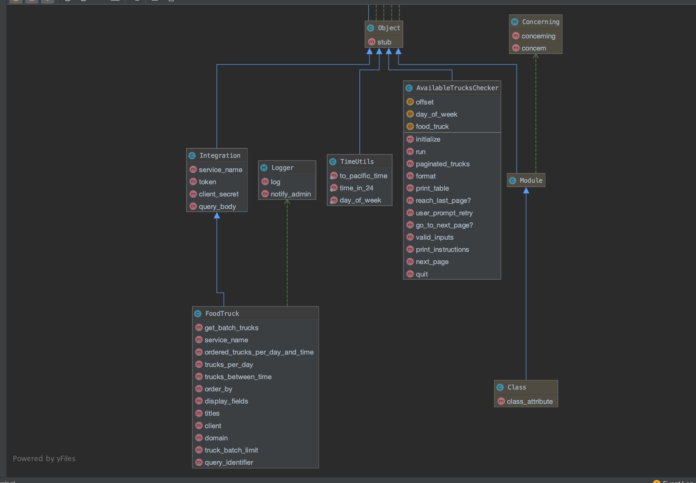

# README

### Note
This project is built with Ruby 2.5.0

README is written in Markdown.

### Set up
* make sure you have Ruby version of 2.5.0
    - in terminal, run `ruby -v`. This should return your current Ruby version.
    - If you do not have the correct Ruby version, I recommend use `RVM` to install Ruby 2.5.0
    - Example below for MacOS:
    ```
        install RVM:
        $ \curl -sSL https://get.rvm.io | bash -s stable
   
        install Ruby 2.5.0 (might need to reopen your terminal after the previous step):
        $ rvm install 2.5.0
        
        Set Ruby 2.5.0 as your current version:
        $ rvm --default 2.5.0
  
        Confirm you are using Ruby 2.5.0:
        $ ruby -v
        should return ruby 2.5.0
   
    ```
    - for more details and troubleshooting visit https://rvm.io/
* download and unzip file
* in terminal, navigate to file directory
* run `ruby scripts/trucks_checker_script.rb`
* [optional] if installing gem fails, run `bundle install` and then `ruby scripts/trucks_checker_script.rb`.

### Proposal to serve millions of concurrent users

1. Use Horizontal Scaling to handle increasing loads and to address single points of failure:
   we could add a Load Balancer such as Amazon's ELB, since ELB is highly available. Alternatively, we could configure our own load balancer, 
   by setting up multiple servers in active-active or active-passive in multiple availability zones will improve availability.
   
2. Limit third party API call to reduce latency and avoid hitting rate limit: 
   we could set up a cron job to make one API call getting all open food trucks on that day. To keep returned data in sync with Socrata dataset, we could either setup a webhook(if any) or run a cron job daily/weekly depending on how frequently dataset gets updated. Considering the current dataset has only 24 columns 
   and 3218 rows (< 5MB) in total, it would be safe to save returned data in the memory. We can then perform quick a filter to get available food trucks per time upon request.
 
### Class Diagram



